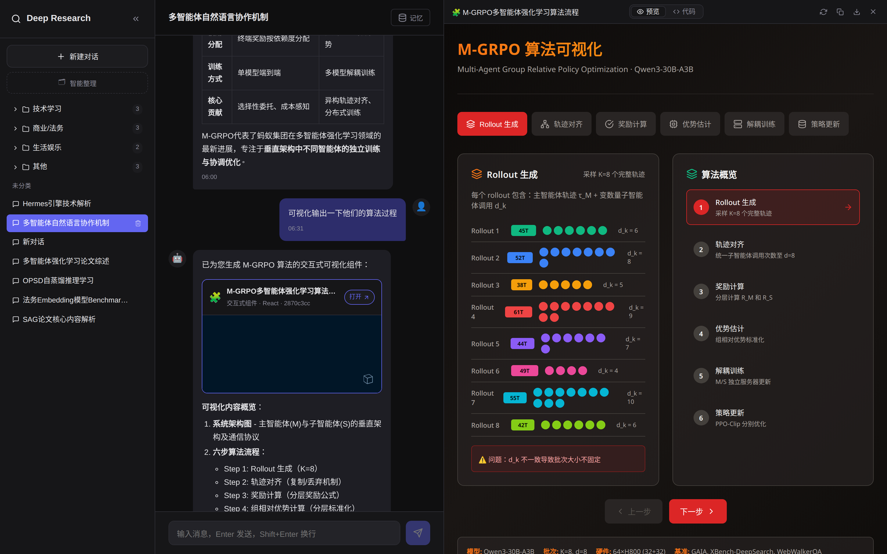
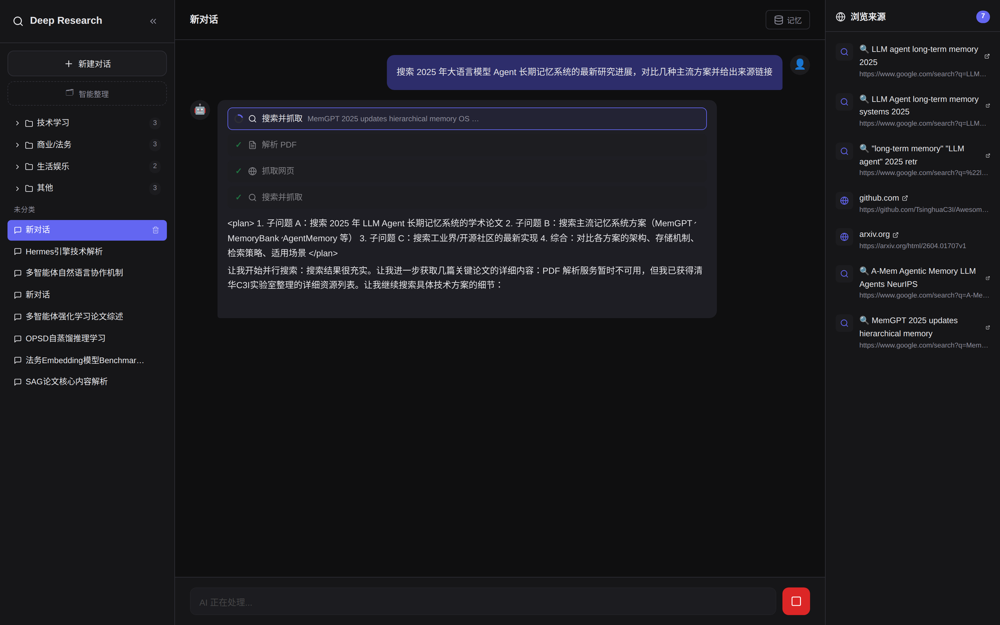
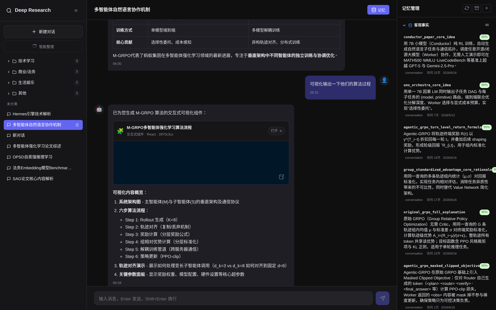
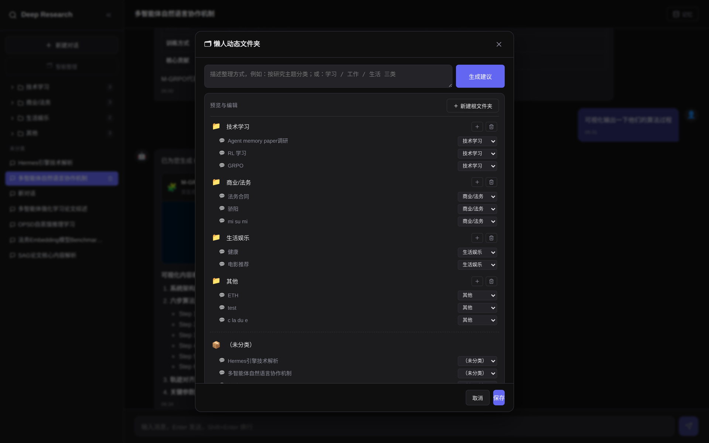
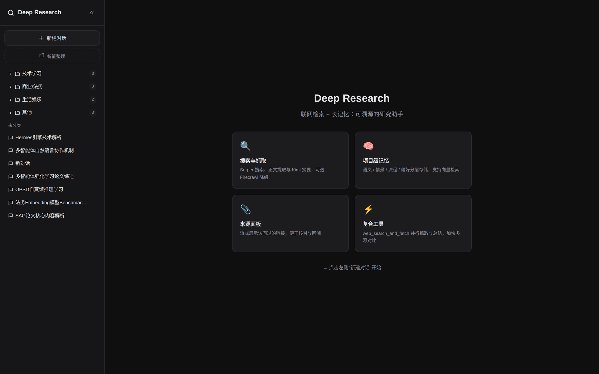
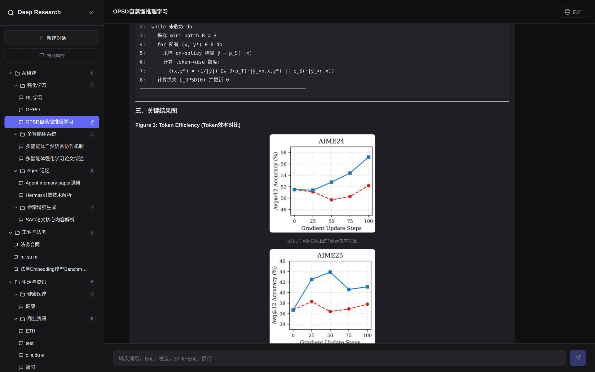

# Deep Research Agent（深度研究助手）

[English](README.md) · **简体中文**

一个可自部署的**深度研究助手**：给它一个问题，单个自主 Agent 就会联网搜索、抓取并总结来源、阅读 PDF（正文**和**图表）、给出引用，还能把研究结果生成为**可交互的 React 可视化**——所有这些都构建在**项目级记忆栈**之上，让每个研究项目跨会话记住事实、结论与你的偏好。

技术栈为 **FastAPI** + **[claude-agent-sdk](https://github.com/anthropics/claude-agent-sdk-python)**，模型使用 **Kimi**（Moonshot 的 Anthropic 兼容端点），前端为 **React + Vite + TypeScript**。

> Agent SDK 运行在 Anthropic 兼容的 API 之上。本项目默认接入 **Kimi（Moonshot）**，但任何 Anthropic 兼容端点都可以在 `.env` 中配置。

<p align="center">
  
  <br/>
  <em>左侧提问，Agent 完成研究后在右侧实时渲染可交互的 React 可视化。</em>
</p>

---

## ✨ 功能特性

- **自主网络研究** —— 通过 [Serper](https://serper.dev) 提供 `web_search`、`web_search_and_fetch` 及 Google Scholar 搜索；网页经 readability 提取后由模型总结，来源会被追踪并在界面中展示。
- **带视觉的 PDF 阅读** —— 下载 PDF，经 [MinerU](https://github.com/opendatalab/MinerU) 服务解析为 Markdown，再用 `pdf_read`（分页）、`pdf_grep`（正则）、`pdf_vision`（用多模态模型对图表/图片提问）。
- **可交互 artifact** —— Agent 可生成单文件、可交互的 **React 组件**（图表用 `recharts`、图标用 `lucide-react`），经 esbuild 编译校验循环验证后在浏览器沙箱中实时渲染。
- **项目级记忆** —— 每轮对话后按主题分段、生成情景摘要，并抽取事实（mem0 风格的 `ADD`/`UPDATE`/`DELETE`）。检索是任务感知的，并按重要度、时间衰减、访问频率、类别以及可选的语义相似度加权。
- **文件夹与组织** —— 把项目归入层级文件夹树，或让 Agent 跨所有项目**推荐**一套结构并批量应用。
- **流式界面** —— 对话回复、工具活动、来源与 artifact 通过 SSE 实时流式呈现。

---

## 📸 界面截图

<table>
  <tr>
    <td width="50%">
      <br/>
      <sub><b>自主网络研究</b> —— 实时展示工具轨迹（搜索 · 抓取 · PDF），右侧<b>来源面板</b>随浏览不断填充。</sub>
    </td>
    <td width="50%">
      <br/>
      <sub><b>项目级记忆</b> —— 客观事实 / 对话摘要 / 决策模式 / 个人偏好分层存储，每条带重要度评分，可就地编辑。</sub>
    </td>
  </tr>
  <tr>
    <td width="50%">
      <br/>
      <sub><b>文件夹与智能整理</b> —— 把项目归入文件夹树，或让 Agent 推荐一套结构并批量应用。</sub>
    </td>
    <td width="50%">
      <br/>
      <sub><b>整体一览</b> —— 简洁的流式界面，侧栏项目、文件夹树与功能概览一目了然。</sub>
    </td>
  </tr>
  <tr>
    <td colspan="2">
      <br/>
      <sub><b>PDF 阅读 · 图文混排</b> —— Agent 阅读论文（正文<b>和</b>图表，经 <code>pdf_vision</code>），把原文图表内联织入回答，与正文、图注交错呈现。</sub>
    </td>
  </tr>
</table>

> 截图来自自部署实例，示例项目仅作演示。

---

## 🏗️ 架构

```
┌─────────────────────────────────────────────────────────────┐
│  前端 (React + Vite + TS)                                     │
│  对话 · Artifact 沙箱 · 记忆面板 · 文件夹 · 来源              │
└───────────────┬─────────────────────────────────────────────┘
                │ REST + SSE  (/api/*)
┌───────────────▼─────────────────────────────────────────────┐
│  FastAPI (main.py)                                            │
│  路由: projects · chat · artifacts · folders                 │
└───────────────┬─────────────────────────────────────────────┘
                │
     ┌──────────▼──────────┐        ┌──────────────────────────┐
     │  Agent 编排器        │        │  记忆管线                 │
     │  claude-agent-sdk    │◄──────►│  分段 → 摘要 → 抽取事实 → │
     │  + Kimi (Anthropic   │  上下文 │  向量化 → 调度 / 衰减     │
     │    兼容)             │        │                          │
     └──────────┬───────────┘        └──────────────┬───────────┘
                │ MCP 服务 "research-tools"          │
     ┌──────────▼───────────────────────────┐       │
     │  工具: web · pdf · memory · artifact  │       │
     └───────────────────────────────────────┘       │
                                                      │
            ┌─────────────────────────────────────────▼───────┐
            │  SQLite (SQLAlchemy 异步)                         │
            │  projects · folders · conversations · artifacts · │
            │  memories                                         │
            └──────────────────────────────────────────────────┘
```

- **单 Agent 设计。** 一个编排器（`agents/orchestrator.py`）通过 Agent SDK 驱动整个研究循环——不做子 Agent 扇出——工具通过名为 `research-tools` 的 MCP 服务暴露。
- **辅助 LLM 调用**（摘要、事实抽取、标题）使用一个轻量异步客户端（`agents/kimi_anthropic.py`），通常跑在比主研究模型更快/更便宜的模型上。
- **SDK 隔离。** SDK 子进程把 transcript 写到仓库内的 `CLAUDE_CONFIG_DIR`，绝不污染你本机的 `~/.claude`。

### 技术栈

| 层 | 技术 |
|----|------|
| 后端 | Python、FastAPI、Uvicorn、claude-agent-sdk、SQLAlchemy 2.0（异步 aiosqlite）、pydantic-settings |
| 模型 | Kimi K2.5 / K2-turbo（Moonshot，Anthropic 兼容）；向量用阿里云 DashScope（`text-embedding-v4`） |
| 搜索/抓取 | Serper API、readability-lxml、markdownify；可选 Firecrawl 降级 |
| PDF | MinerU 解析服务 + Kimi 多模态视觉 |
| 前端 | React、Vite、TypeScript、recharts、lucide-react、react-markdown、KaTeX |

---

## 📂 项目结构

```
.
├── main.py              # FastAPI 入口（路由、CORS、启动）
├── config.py            # 配置（pydantic-settings，读取 .env）
├── agents/
│   ├── orchestrator.py  # 单 Agent 研究循环（同步 + SSE 流）
│   ├── base.py          # ClaudeAgentOptions、prompt 加载、时间块
│   ├── kimi_anthropic.py# 辅助调用用的轻量 Kimi 客户端
│   ├── mcp_registry.py  # 暴露 "research-tools" MCP 服务
│   ├── multimodal/      # PDF 图片 → 视觉消息构建
│   └── tools/           # web / pdf / memory / artifact 工具
├── api/routes/          # projects · chat · artifacts · folders
├── memory/              # 分段 · 摘要 · 抽取 · 向量化 · 调度
├── db/                  # SQLAlchemy 模型、crud、异步引擎 + 迁移
├── schemas/             # Pydantic 请求/响应模型
├── prompts/             # 系统提示词（Markdown）
├── scripts/             # verify_import.py（冒烟检查）
└── frontend/            # React + Vite + TypeScript 界面
```

---

## 🚀 快速开始

### 前置条件

- Python **3.10+**
- Node.js **≥ 20.19**（Vite）—— 推荐 [nvm](https://github.com/nvm-sh/nvm)
- API 密钥：**Kimi/Moonshot**（必需）、**Serper**（网络搜索必需）、**DashScope**（可选，用于语义记忆）
- *（可选）* 一个 **[MinerU](https://github.com/opendatalab/MinerU)** 解析服务（如需 PDF 阅读）

### 1. 配置环境变量

```bash
cp .env.example .env
# 编辑 .env：ANTHROPIC_AUTH_TOKEN、SERPER_API_KEY、EMBEDDING_MODEL_API_KEY 等
```

关键变量见下文 [配置](#-配置)。

### 2. 后端

```bash
python -m venv .venv
source .venv/bin/activate            # Windows: .venv\Scripts\activate
pip install -r requirements.txt
npm install                          # 根目录 esbuild —— 可交互 artifact 必需
python scripts/verify_import.py      # 应输出: OK <APP_TITLE>
python main.py
```

- 监听 `API_HOST:API_PORT`（默认 `0.0.0.0:8808`）。
- API 文档：<http://127.0.0.1:8808/docs>
- 根目录的 `npm install` 提供用于校验生成 React artifact 的 `esbuild`；若不需要 artifact 可跳过。

### 3. 前端

```bash
cd frontend
npm ci
npm run dev
```

- 开发端口：`frontend/.env.development` 中的 `VITE_DEV_PORT`（默认 **3020**）。
- `/api` 代理到 `http://127.0.0.1:<VITE_API_PORT>` —— 保持 `VITE_API_PORT` 与后端 `API_PORT` 一致。

### 4. PDF 解析服务 —— MinerU（可选）

PDF 工具（`pdf_parse` / `pdf_read` / `pdf_grep` / `pdf_vision`）会调用一个自部署的
**[MinerU](https://github.com/opendatalab/MinerU)** API，把 PDF 转成 Markdown。按 MinerU 官方文档部署其
API 服务后，把后端指向它的 `/file_parse` 端点：

```bash
# .env
PDF_PARSE_URL=http://<mineru-host>:8000/file_parse
```

如果不需要 PDF 阅读可整体跳过。安装与部署详见 [MinerU 仓库](https://github.com/opendatalab/MinerU)。

### 生产部署（简要）

1. **后端：** `uvicorn main:app --host $API_HOST --port $API_PORT`（注入与 `.env` 一致的环境变量）。SQLite 下保持 `UVICORN_WORKERS=1`；要扩多 worker 请先换 PostgreSQL。
2. **前端：** `npm run build`，用任意静态服务器托管 `frontend/dist/`，并把 `/api` 反向代理到后端（等价于开发时的 Vite 代理）。

---

## ⚙️ 配置

所有配置从 `.env` 读取（见 [.env.example](.env.example)）。重点项：

| 变量 | 用途 | 默认 |
|------|------|------|
| `ANTHROPIC_BASE_URL` | Anthropic 兼容端点（Kimi） | `https://api.moonshot.ai/anthropic` |
| `ANTHROPIC_AUTH_TOKEN` | Kimi/Moonshot API 密钥 | — |
| `ANTHROPIC_MODEL` | 主研究模型 | `kimi-k2.5` |
| `SERPER_API_KEY` | 网络/学术搜索（[serper.dev](https://serper.dev)） | — |
| `EMBEDDING_MODEL_URL` / `EMBEDDING_MODEL_API_KEY` | DashScope 向量（语义记忆，可选） | DashScope |
| `FIRECRAWL_API_KEY` | 可选的 JS 渲染抓取降级 | — |
| `PDF_PARSE_URL` | PDF 的 MinerU 解析服务 | `http://127.0.0.1:8000/file_parse` |
| `PDF_VISION_MODEL` | 处理 PDF 图表的多模态模型 | （回退到摘要模型） |
| `DATABASE_URL` | SQLite（生产建议绝对路径） | `sqlite+aiosqlite:///./deepresearch.db` |
| `API_HOST` / `API_PORT` | 后端监听地址 | `0.0.0.0` / `8808` |
| `MEMORY_SUMMARY_THRESHOLD` | 触发情景摘要的对话轮数 | `10` |
| `CLAUDE_CONFIG_DIR` | 隔离的 SDK 配置目录（避免污染 `~/.claude`） | `./.claude-runtime` |

> 开发时用 `APP_DEBUG=true`（不要用通用的 `DEBUG`），以免被 `DEBUG=release` 这类非布尔值污染。

**端口速查**（避免冲突只改这几个）：

| 用途 | 变量 / 文件 | 默认 |
|------|-------------|------|
| 后端端口 | `.env` → `API_PORT` | 8808 |
| 前端开发端口 | `frontend/.env.development` → `VITE_DEV_PORT` | 3020 |
| 前端 → 后端代理 | `VITE_API_PORT`（须等于 `API_PORT`） | 8808 |
| 静态预览 | `VITE_PREVIEW_PORT`（`npm run preview`） | 3021 |

---

## 🔌 主要 API

| 方法 | 路径 | 说明 |
|------|------|------|
| `GET` / `POST` | `/api/projects` | 列表 / 创建项目 |
| `GET` / `PATCH` / `DELETE` | `/api/projects/{id}` | 读 / 改 / 删项目 |
| `GET` / `POST` … | `/api/projects/{id}/memory` | 记忆面板 + 手工增删改 |
| `POST` | `/api/chat` | 非流式对话（`project_id`、`message`、`session_id?`） |
| `POST` | `/api/chat/stream` | SSE 流式对话（`status`、`text`、`tool_start`、`tool_result`、`artifact`、`task_*`、`done`） |
| `GET` | `/api/chat/{project_id}/history` | 最近消息 |
| `GET` | `/api/chat/{project_id}/sessions` | 会话列表 |
| `GET` / `POST` | `/api/artifacts` | 列出 / 获取生成的 artifact |
| `GET` / `POST` … | `/api/folders` | 文件夹树增删改、`/suggest`、`/apply`、`/assign` |

完整交互式文档见 `/docs`（Swagger）与 `/redoc`。

---

## 🧠 记忆系统

每个项目维护四类记忆：

- **semantic（语义）** —— 事实、定义、数据点、文献结论、实体
- **episodic（情景）** —— 按主题分段的对话摘要
- **procedural（程序性）** —— 搜索策略、核查习惯、提纲偏好
- **preference（偏好）** —— 来源偏好、深度/格式/语言偏好

每轮对话后，管线按主题分段、写情景摘要、抽取/更新事实（mem0 风格），并（可选）向量化以便语义召回。检索是**任务感知**的——文献检索、综合写作、事实核查会对各类别赋予不同权重。

---

## 📝 许可证

基于 [MIT 许可证](LICENSE) 发布。

---

## 🙏 致谢

[claude-agent-sdk](https://github.com/anthropics/claude-agent-sdk-python) · [Kimi / Moonshot AI](https://www.moonshot.ai) · [Serper](https://serper.dev) · [MinerU](https://github.com/opendatalab/MinerU) · [FastAPI](https://fastapi.tiangolo.com) · [Vite](https://vitejs.dev)
